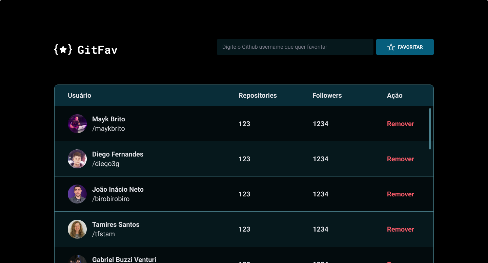

<div align="center">
  <h2 align="center">GitFav</h2>
</div>

<br/>
<br/>



### Sobre

Esse projeto é para colocar em prática o conhecimento aprendido sobre: SPA (Single Page Application), eventos no JavaScript, assincronismo, promises, POO (Programação Orientada a Objetos) como classes, herança e polimorfismo, imutabilidade, erros da aplicação utilizando métodos try, catch e throw, localStorage e também trabalhando com a  API do Github.

### Pré-requisitos

Antes de começar, certifique-se de que preenche os seguintes requisitos:

- [Git](https://git-scm.com/downloads "Download Git") deve estar instalado no seu sistema operacional.

### Rodar o projeto

Para rodar o projeto localmente, basta executar o comando abaixo:

Linux e macOS:

```bash
sudo git clone https://github.com/denilsonbaptista/GitFav.git
```

Windows:

```bash
git clone https://github.com/denilsonbaptista/GitFav.git
```

### Contato

Se você quiser entrar em contato comigo, pode me encontrar no [Linkedin](https://www.linkedin.com/in/denilsonbaptista/)

### Licença 

Este projeto é de uso gratuito e não contém nenhuma licença.